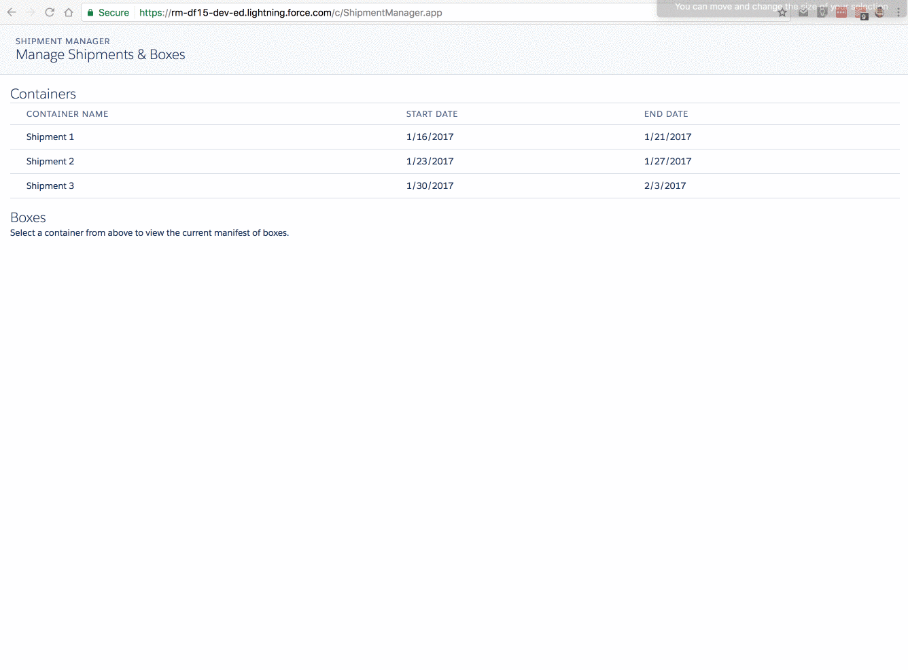

# Shipment Manager
This is a sample Lightning Component app that allows for managing shipments of Boxes in Containers.

Each Container can have some Boxes, and a user can select a Container to see which boxes exist within that Container. Users can also add a new Box to a Container.

## Demo

Here's a quick demo of the app in the browser. If you'd like to check it out in your Salesforce org, feel free to install from the production or sandbox URLs below.

- [Production Installation](https://login.salesforce.com/packaging/installPackage.apexp?p0=04t61000000kf4y)
- [Sandbox Installation](https://login.salesforce.com/packaging/installPackage.apexp?p0=04t61000000kf4y)

